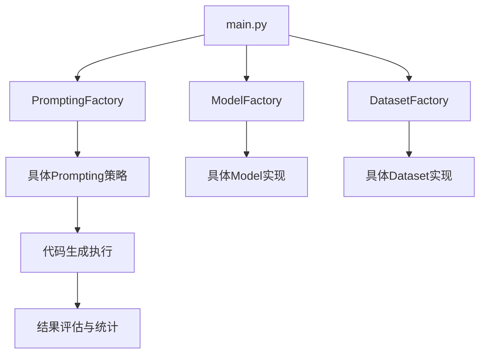

# 代码生成器项目结构分析

## 整体架构

项目采用工厂模式组织各个模块,主要包含以下核心组件:

- Models: AI模型接口封装
- Promptings: 提示策略实现 
- Datasets: 数据集加载
- Results: 结果管理
- Utils: 工具函数

## 调用流程



## 核心模块说明

### Models模块
- ModelFactory: 模型工厂类
- OpenAI: OpenAI模型实现
- Gemini: Google Gemini模型实现

### Promptings模块 
- PromptingFactory: 提示策略工厂
- 支持策略:
  - Direct: 直接生成
  - CoT: 思维链
  - SelfPlanning: 自我规划
  - Analogical: 类比推理
  - CodeSIM系列: 多种优化版本

### Datasets模块
- DatasetFactory: 数据集工厂
- 支持数据集:
  - HumanEval
  - MBPP
  - APPS
  - xCodeEval 
  - CC

## 配置项说明

主要通过命令行参数配置:

- dataset: 选择数据集
- strategy: 选择生成策略
- model: 选择模型
- language: 编程语言
- 其他运行参数(temperature, top_p等)

## 执行流程

1. 解析命令行参数
2. 初始化各个组件
3. 执行代码生成
4. 评估结果
5. 生成报告

## 扩展建议

添加新模型时:

1. 在models目录下创建新的模型类
2. 在ModelFactory中注册
3. 确保实现统一的模型接口


# 使用腾讯云 deepseek-v3 模型运行,ollama3.2:3b

```python
python src/main.py --model_provider TencentCloud --model deepseek-v3 --dataset HumanEval --strategy Direct
python src/main.py --model_provider ollama --model llama3.2:3b --dataset HumanEval --strategy Direct

python src/main.py --model_provider ollama --model llama3.2:3b --dataset HumanEval --strategy CodeSIM
```


# 或者简单使用默认配置

```python
python src/main.py --model_provider TencentCloud
```

